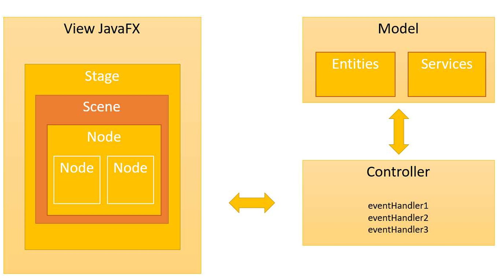

<h1 align="center">🔗 Projeto JavaFX com JDBC</h1>

<h2 align="center">Curso Udemy: Programação Orientada a Objetos com Java</h2>

### 📌Introdução

#### Este projeto faz parte do curso Programação Orientada a Objetos com Java, ministrado na Udemy pelo professor [Nelio Alves](https://github.com/acenelio). O objetivo é fornecer uma visão geral sobre o desenvolvimento de interfaces gráficas utilizando JavaFX. O JavaFX é uma poderosa biblioteca para a criação de interfaces ricas e dinâmicas, sendo o sucessor do Swing e Java AWT. Com o JavaFX, é possível desenvolver aplicações gráficas para desktop, web e dispositivos móveis. Ele oferece uma série de componentes visuais que facilitam a criação de aplicações interativas e modernas.

---

### 🎯 Objetivo

O objetivo deste guia é apresentar os principais conceitos e componentes do JavaFX, abordando desde a instalação e configuração do ambiente até a criação de interfaces utilizando a estrutura de MVC (Model-View-Controller). Além disso, o conteúdo abrange o uso do Scene Builder, manipulação de eventos e criação de controles gráficos como TextFields, Labels, ComboBoxes e mais.

---

### 📋 Tópicos Abordados:
- **Fundamentos do JavaFX**: Entendendo a estrutura do JavaFX e seus principais componentes.
- **Configuração do Ambiente**: Como configurar o JavaFX no Eclipse, incluindo o uso do Scene Builder.
- **Modelo MVC**: Como o JavaFX segue o padrão MVC (Model-View-Controller) para a organização de código.
- **Eventos e Interações**: Tratamento de eventos de interação com o usuário, como cliques e digitação.
- **Componentes Gráficos**: Uso de controles como TextField, Label, ComboBox, e outros componentes para criar interfaces ricas.
- **Layouts**: Exploração dos principais containers de layout disponíveis no JavaFX, como AnchorPane VBox & HBox, GridPane, SplitPane, ScrollPane e BorderPane.

---

### 🔍 Visão Geral do JavaFX e MVC  

- **JavaFX** é o sucessor do **Swing** e **Java AWT** para a criação de interfaces gráficas com Java.  
- Pode ser utilizado para **aplicações desktop, web e mobile**.  
- As telas em **JavaFX** podem ser construídas tanto via **código Java** quanto via **FXML**.  
- A partir do **Java 11**, o JavaFX não faz mais parte do **JDK**, sendo necessário fazer o **download e configuração separada**.  
  - O JavaFX é mantido pela **Gluon**: [Gluon JavaFX](https://gluonhq.com/products/javafx/)  

### 🏗️ JavaFX e o Padrão MVC  

O **JavaFX** segue a arquitetura **MVC** (**Model-View-Controller**), que separa a lógica da aplicação em três partes principais:  

- **🗄️ Model:** Contém os **dados de domínio** e a **lógica de negócios**.  
- **🖥️ View:** Responsável pela **interface gráfica** e pela **exibição dos dados** ao usuário.  
- **🎮 Controller:** Manipula os **eventos de interação**, conectando a **View** ao **Model**.  

---

### 📌 Arquitetura MVC no JavaFX  
  

- #### [Hierarquia do JavaFX](https://openjfx.io/javadoc/17/overview-tree.html)

---

### 🎓 Conclusão  

Este projeto me proporcionou uma compreensão mais profunda sobre a **arquitetura MVC no JavaFX** e como ela contribui para um código mais organizado e modular. Ao longo do desenvolvimento, aprendi a:  

✔️ Configurar o ambiente do JavaFX e utilizar o Scene Builder para facilitar a criação da interface gráfica.  
✔️ Aplicar o padrão **MVC** para separar a lógica de negócios, interface e controle dos eventos.  
✔️ Manipular eventos e interações do usuário de forma eficiente.  
✔️ Trabalhar com diferentes componentes gráficos do JavaFX, como **Labels, TextFields, ComboBoxes e Botões**.  
✔️ Explorar os **layouts disponíveis**, garantindo uma interface responsiva e intuitiva.  

O **JavaFX** se mostrou uma ferramenta poderosa para o desenvolvimento de aplicações gráficas modernas e escaláveis. A experiência adquirida nesse projeto fortaleceu meu entendimento sobre **desenvolvimento orientado a objetos**, **componentização** e **boas práticas na criação de interfaces gráficas** com Java. ☕  

--- 
| 🌎 LinkedIn | 👨‍💻 **Autor** |
|------------|---------------|
| [LinkedIn](https://www.linkedin.com/in/albert-backend-java-spring-boot/) | [Albert Silva](https://www.linkedin.com/in/albert-backend-java-spring-boot/) |
